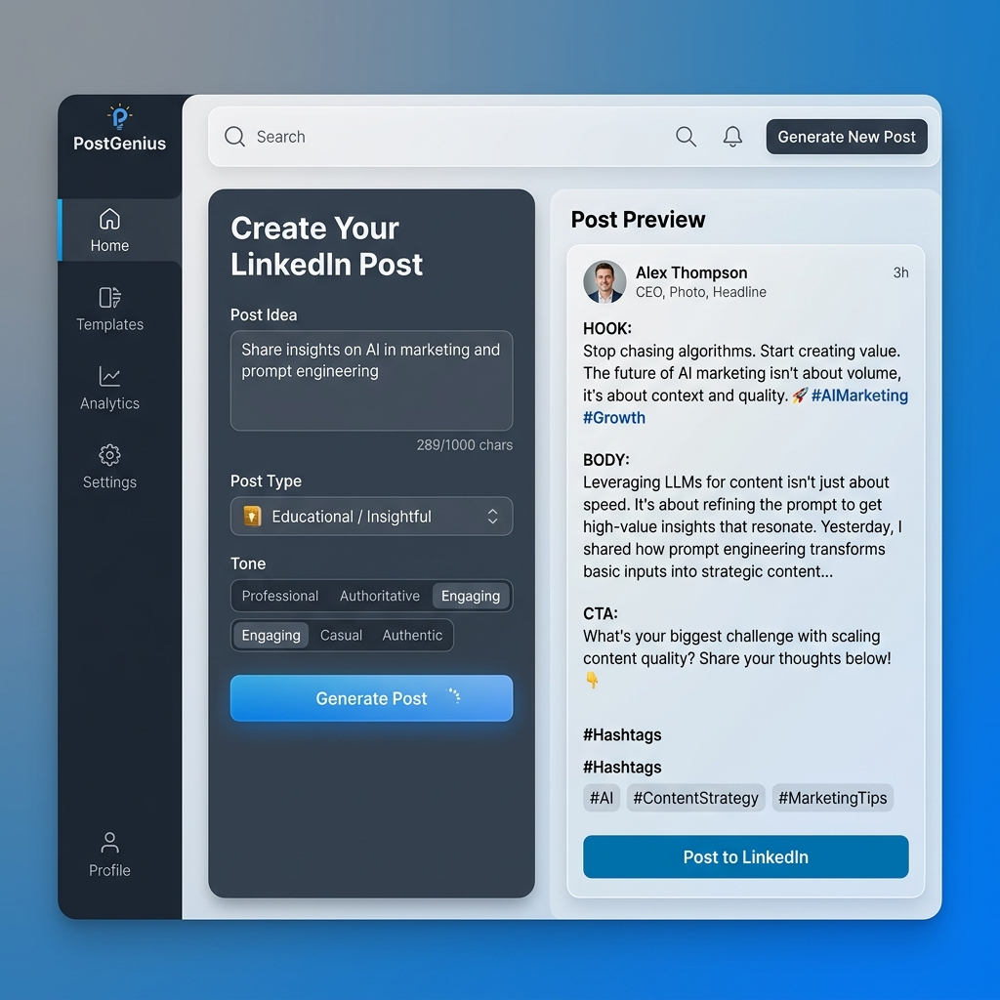

# PostGenius — LinkedIn Post Architect



PostGenius is a high-fidelity, lightweight LinkedIn post generator designed for creators and professionals. It transforms raw ideas into structured, high-performing drafts using proven content frameworks—all without leaving your browser.

## ✨ Key Features

- **Strategic Frameworks**: Choose from Thought Leadership, Personal Story, Lesson Learned, or Educational templates.
- **Dynamic Tones**: Switch between *Professional* and *Casual* voices with real-time word replacement.
- **Architecture Library**: Save your best blueprints locally using browser `localStorage` for future refinement.
- **Pattern Interrupts**: Every generation provides multiple "Hook" variations to stop the scroll.
- **Optimized CTAs**: Tailor your Call to Action or use high-converting defaults.
- **Automated Hashtags**: AI-suggested tags based on your core topic.
- **Modern ESM Foundation**: Built with standard ES Modules for a future-proof, no-build-step architecture.

## 🧠 Content Strategy

PostGenius doesn't just "write text." It follows the **"The Slide"** methodology:
1.  **The Hook**: A pattern-interrupting opening line to grab attention.
2.  **The Body**: Structured content that provides immediate value or insight.
3.  **The CTA**: A clear, low-friction invitation to engage.

## 🚀 Quick Start

1.  **Open**: Simply open `index.html` in any modern web browser.
2.  **Ideate**: Enter your core topic (e.g., "Why sleep is the ultimate productivity hack").
3.  **Configure**: Select your preferred style, length, and target audience.
4.  **Generate**: Click "Generate Drafts" and watch your post come to life.
5.  **Refine**: Copy to clipboard or save to your personal library.

## 🛠️ Tech Stack

- **Core**: Vanilla HTML5, CSS3, and ES6+ JavaScript (ES Modules).
- **Styling**: LinkedIn-inspired slate and blue palette with a fully responsive two-pane grid layout.
- **Persistence**: Zero-backend `localStorage` for draft management.
- **Testing**: Vitest for robust unit testing of generation logic.
- **Linting**: ESLint for maintaining code consistency.

## 📁 Project Structure

```
.
├── index.html          # Semantic HTML5 Structure
├── style.css           # Premium CSS3 with Variables & Animations
├── script.js           # ES Module Logic & DOM Interaction
├── script.test.js      # Vitest Unit Tests
├── README.md           # Documentation
├── CHANGELOG.md        # Version & Fix History
├── AGENTS.md           # Developer & AI Contributor Instructions
├── package.json        # Tooling Configuration (v1.4.1)
├── LICENSE             # MIT License
└── .github/
    └── workflows/
        └── static.yml  # Automated GitHub Pages Deployment
```

## 👨‍💻 Development

PostGenius is designed for speed. No build step is required for basic development, but you can use the following tools for maintenance:

```bash
# Install development dependencies (ESLint, Vitest)
npm install

# Run unit tests
npm run test

# Run linter
npm run lint
```

## 🔒 Security & Privacy

- **Privacy First**: All generation happens locally in your browser. No data is sent to external servers.
- **XSS Prevention**: Strict use of `textContent` and `createTextNode` for all user-provided data rendering.
- **Zero Secrets**: No API keys, no databases, and no tracking scripts.

## 📜 License

Distributed under the MIT License. See `LICENSE` for more information.
